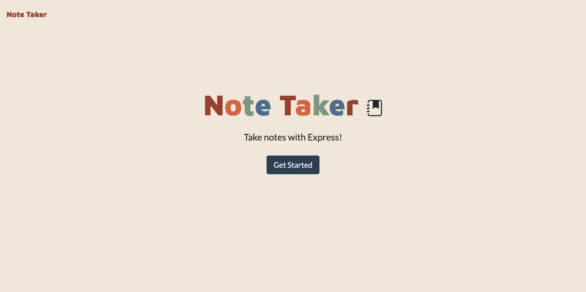
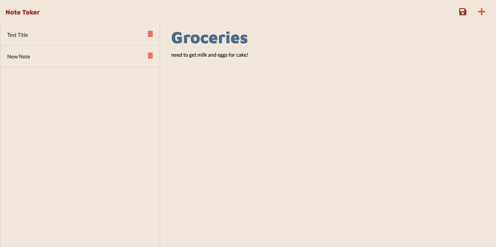

# NOTE TAKER APP

# License

[MIT](https://opensource.org/licenses/MIT)

# Description
Note Taker is an application that can be used to write and save notes. The application uses an Express.js back end and saves and retrieves note data from a JSON file with the application being deployed through Heroku.

# User Story
```
AS A small business owner
I WANT to be able to write and save notes
SO THAT I can organize my thoughts and keep track of tasks I need to complete
```

# Table of Contents:
- [License](#license)
- [Description](#description)
- [User Story](#userstory)
- [Usage](#usage)
- [Questions](#questions)
- [Credits](#credits)
  

# Usage
This application is a useful little tool for a user wanting to keep themselves organised! At homepage, the user will click on the get started button and will delivered to the main notes page. Here, they can enter a new note title and note body and then press the save button at the top right hand side to see their note saved in the left column. To add another note, the user just needs to click the plus sign (top right corner) and enter in their new details.

See below screenshots of the homepage and main page as well as a gif showing the app in action! 






# Questions
If you have any queries or questions in relation to this application, please send to madeleine.codes@gmail.com.

# Credits
https://github.com/madeleinesc

